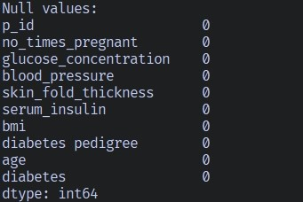
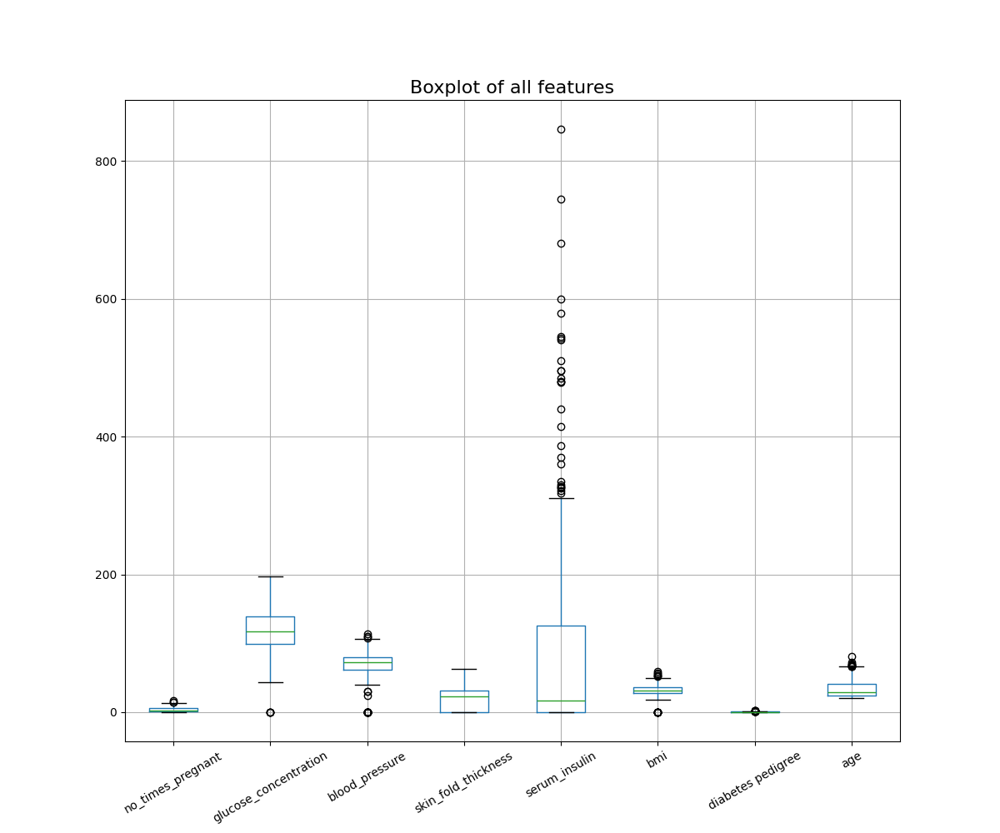
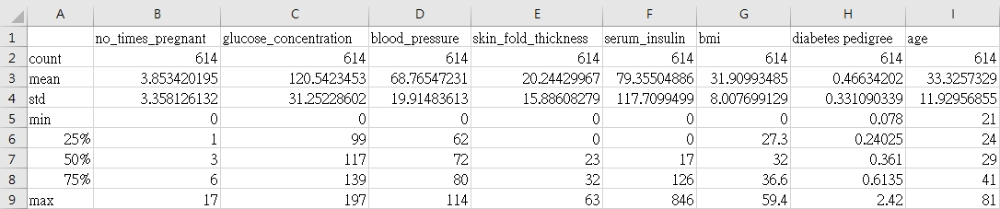
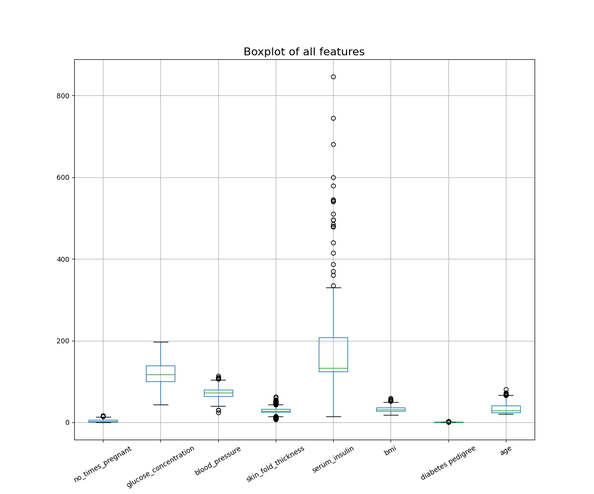
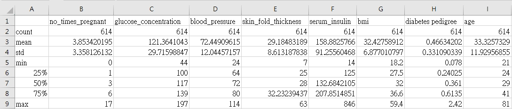
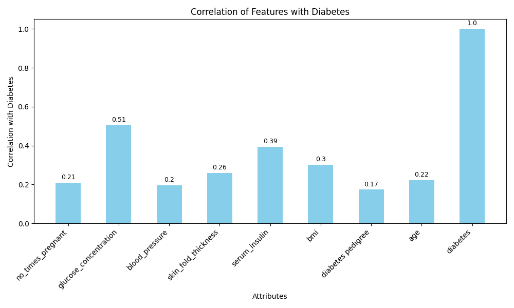
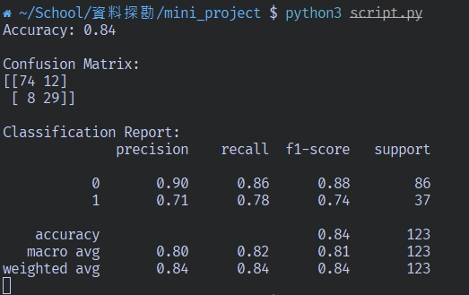
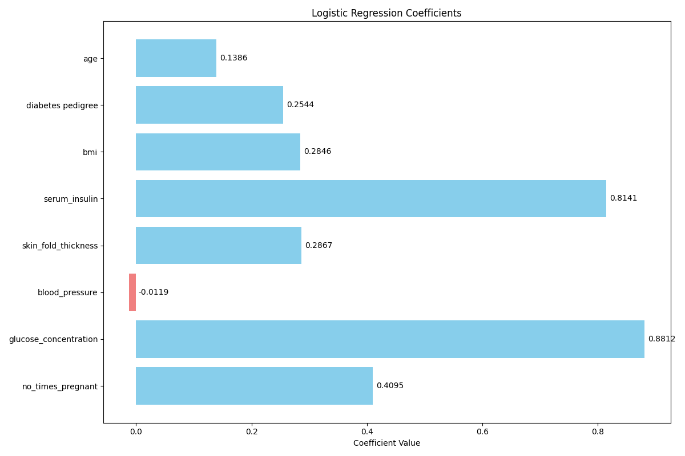
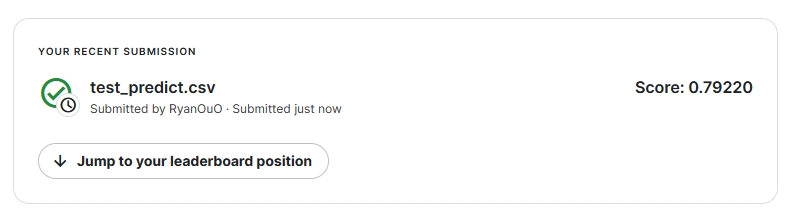

## Data Mining mini project - Pima Indians Diabetes Database

### 1. 資料集特徵資料說明、屬性特性說明

Pima Indians Diabetes Database 的資料集中包含了來自 Pima Indian 印地安部落的患者與糖尿病相關的健康資訊，總共768筆資料（包含training set 和 test set），包括如下的十個特徵：

| 特徵名稱              | 特徵說明                                    | 特徵屬性          | 數據類型 | 數據類型   |
| --------------------- | ------------------------------------------- | ----------------- | -------- | ---------- |
| p_id                  | 患者ID                                      | Unique Identifier | Nominal  | -          |
| no_times_pregnant     | 懷孕次數                                    | Integer           | Ratio    | Discrete   |
| glucose_concentration | 口服葡萄糖耐量試驗中2小時後的血漿葡萄糖濃度 | Floating point    | Ratio    | Continuous |
| blood_pressure        | 血壓（mm Hg）                               | Integer           | Ratio    | Discrete   |
| skin_fold_thickness   | 三頭肌位置的皮膚褶皺厚度（mm）              | Integer           | Ratio    | Discrete   |
| serum_insulin         | 血清胰島素（mu U/ml）                       | Floating point    | Ratio    | Continuous |
| bmi                   | 體重指數（weight in kg/(height in m)^2）    | Floating point    | Ratio    | Continuous |
| diabetes_pedigree     | 糖尿病谱系功能                              | Floating point    | Ratio    | Continuous |
| age                   | 年齡（years）                               | Integer           | Ratio    | Discrete   |
| diabetes              | 是否患有糖尿病（0 or 1）                    | Binary            | Nominal  | -          |

### 2. 對特徵做甚麼樣的分析? 哪些前處理? 採⽤哪些特徵? 原因?

#### 檢查缺失值

從上圖可以看出，所有欄位都沒有缺失值。

---

#### 異常值分析

首先，我將資料集中除了id和diabetes以外所有數值型特徵繪製成一張盒狀圖，以及一張統計摘要表格，以便觀察是否有異常值：

**Boxplot of all features**

**Statistics**

可以看出，除了`no_times_pregnant`、`diabetes_pedigree`和`age`外，其他欄位都存在不正常的0值，例如bmi不可能為0，卻出現了0值，這些0值很可能實際上是缺失值。

為了填補這些異常值，我採用了如下的處理步驟：

- 將0值替換成NaN：首先，我將異常的0值替換成NaN，以將它們做為缺失值來處理。

- 分堆計算平均值：接著，我將資料集根據`diabetes`（是否患有糖尿病）分成兩堆，分別計算每一組的平均值。這麼做的目的是保留患有糖尿病和未患有糖尿病個體之間可能存在的不同特徵值分佈，以此增加後續分類的準確性。

- 將NaN替換成平均值：最後，將NaN替換成各自對應的平均值。

> 註：對於測試集，我則是將NaN替換成了訓練集整體的平均值。

經過上述處理後，再次繪製盒狀圖和統計摘要表格，可以看到異常值已經被處理掉了：

**Boxplot of all features**

**Statistics**

---

#### 特徵關聯性分析

接下來，我對各個特徵進行了與`diabetes`的關聯性分析，我使用了`pandas`的`corr()`函數來計算它們的Pearson Correlation Coefficient。以下是分析的結果：

**Correlation**

從上圖可以看出，所有的特徵對於`diabetes`都具有正相關，這意味著隨着這些特徵值的增加，患有糖尿病的可能性也會跟著增加，其中，又以 `glucose_concentration`、`serum_insulin`和`bmi`這三個特徵有較高的關聯性。

考慮到資料集本身的維度其實並不太高，且特徵對於與目標分類皆具有正相關，所以我決定保留所有特徵來進行後續的分析，以得到更全面的分類效果。

---

#### 特徵標準化

由於各個特徵的取值範圍差距甚大，為了確保模型在訓練過程中可以更好地收斂並提高訓練的性能，我使用 StandardScaler 來對特徵進行標準化處理，之所以使用 StandardScaler 有兩個原因：

- 根據之前的特徵關聯性分析，各特徵對於 diabetes 的相關性大致呈現正向關聯。由於 StandardScaler 保留了原始數據的分佈形狀，這有助於模型更好地捕捉到特徵之間的相對變化。

- 即便經過缺失值的處理，資料集中的特徵值仍可能存在異常值，尤其從箱型圖可以觀察到，`serum_insulin`仍保有不少的極端值，而 StandardScaler 對異常值相對敏感，這有助於確保模型在訓練過程中可以更加穩定。

### 3. 基於什麼理由選擇哪個分類器?

我選擇使用Logistic Regression來進行分類，主要有以下幾個原因：

- Logistic Regression 是一種簡單且直觀的分類器，適用Diabetes這種二元分類問題，實做起來相對容易，結果也較易於解釋。

- Logistic Regression 在資料量較少的情況下表現穩定，較不容易出現過擬合的問題。

- 透過 Logistic Regression 模型的回歸係數，我們可以了解每個特徵對於預測目標的貢獻程度。回歸係數的大小和方向反映了特徵對於分類結果的相對影響，這有利於我們進行後續的結果分析。

### 4. 採⽤的評估指標結果與觀察

我將Training set分成了Training set和Testing set，其中Training set佔80%，Testing set佔20%。經過 Logistic Regression 的訓練，我得到了如下的結果：

---

#### Accuracy

模型在經過 Training set 的訓練後，在測試集上的準確度為 0.84，這表示模型能夠正確預測 84% 的樣本，即在整體上有着不錯的預測能力。

---

#### Confusion Matrix

Confusion Matrix 顯示了模型在測試集上的預測結果，其中：

- True Positive (TP): 29，模型正確預測為糖尿病的樣本數。

- True Negative (TN): 74，模型正確預測為非糖尿病的樣本數。

- False Positive (FP): 12，模型誤判為糖尿病的樣本數。

- False Negative (FN): 8，模型誤判為非糖尿病的樣本數。

---

#### Classification Report

分類報告提供了更詳細的性能指標，其中：

- Precision：分別為 0.90 和 0.71，表示模型正確預測為非糖尿病和糖尿病的樣本中，有多少是真正的非糖尿病或糖尿病。

- Recall：分別為 0.86 和 0.78，表示實際為非糖尿病和糖尿病的樣本中，有多少被模型成功預測。

- F1-score：分別為 0.88 和 0.74，是 Precision 和 Recall 的調和平均值，提供了綜合性的性能評價。

從這裡可以看出，模型對於糖尿病的預測準確度較低，而對於非糖尿病的預測準確度較高，這可能是因為訓練集中糖尿病的樣本數量較少，導致模型在訓練過程中對於糖尿病的預測能力較不完全。

而就整體而言，模型的預測能力尚可，但仍有進一步提升的空間，尤其在糖尿病樣本的預測上，模型的 Precision 和 Recall 都仍有較大的提升空間，在樣本數有限的情況下，或許可以透過調整學習率、或是正負例權重的方式來進行模型的提升；或者，選用更複雜的分類器可能也會有所幫助。

---

#### Coefficients

在 Logistic Regression 模型訓練後，我們得到了每個特徵的回歸係數。以下是這些係數以及對應的特徵：

可以發現，各個特徵的回歸係數對於糖尿病的預測情形與程度大致上都與最初進行的關聯性分析結果一致，其中，`glucose_concentration`和`serum_insulin`對於糖尿病的預測有着最顯著的正相關。

特別的是，`blood_pressure`的回歸係數為負值，這與我們最初進行關聯性分析時所得出的弱正相關的結果相悖。這可能是由於其他特徵對其所造成的影響，例如，由於`glucose_concentration`和`serum_insulin`對於糖尿病的預測有着較大的正相關，而`blood_pressure`與這兩個特徵的相關性較弱，所以在模型訓練過程中，`blood_pressure`的回歸係數受到了其他特徵的影響，導致其回歸係數為負值。

因此，`blood_pressure`的回歸係數為負值，並不代表其單獨對糖尿病的預測有着負面影響，而更可能是在考慮其他相關特徵的情況下所呈現的結果。

### 5. 將預測結果上傳⾄ kaggle 並截圖測試的分數

